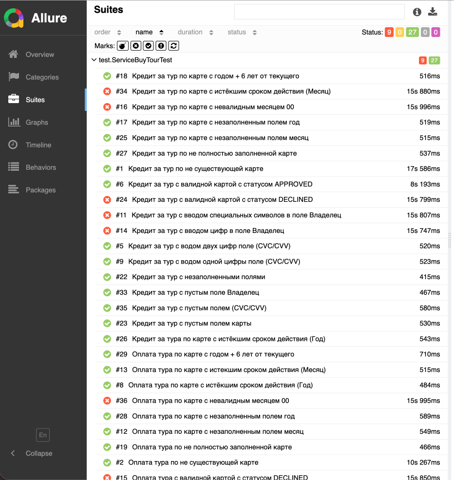
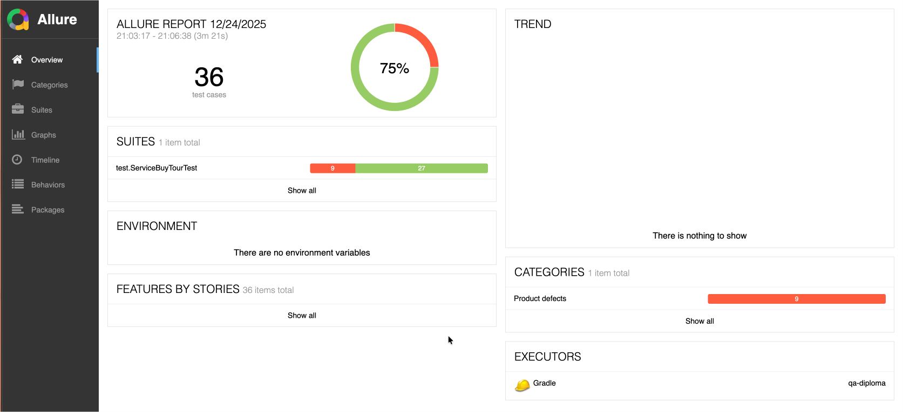

# Отчёт по итогам тестирования

## краткое описание;
Проведено автоматизированное тестирование комплексного веб-сервиса по покупке туров. 
Тестирование охватывало UI-сценарии оплаты по дебетовой карте и в кредит, проверку взаимодействия с симулятором банковских сервисов и корректности сохранения данных в СУБД (MySQL и PostgreSQL). 
Для наглядного представления результатов использовался фреймворк Allure, который позволяет визуализировать данные в виде графиков и диаграмм, а также детализировать каждый тестовый шаг.
## количество тест-кейсов;
Всего было автоматизировано и выполнено **36** тест-кейсов.
* Распределение по функциональности:
    * Покупка тура с помощью дебетовой карты (форма "Оплата по карте"): **18** тестов.
    * Покупка тура в кредит (форма "Кредит по данным карты"): **18** тестов.
    * Проверка корректности записи данных в БД: **4** тестов.
    * Валидация полей ввода: **32** теста.
 
## процент успешных и не успешных тест-кейсов;
* **Успешных:** 27 (75%)
* **Неуспешных:** 9 (25%)

Высокий процент неуспешных тестов (25%) свидетельствует о наличии критических дефектов в реализации сервиса, что соответствует заявленному в задании.
## общие рекомендации.
На основе результатов тестирования сформулированы следующие рекомендации:
1.  **Критический дефект записи в БД**: При оплате отклонённой картой (`4444 4444 4444 4442`) в базу данных записывается статус `DECLINED`, а в веб клиенте появляется сообщение "Операция одобрена банком". Необходимо исправить логику обработки ответов от банковского симулятора.
2.  **Отсутствие валидации полей**: Поле  "Владелец" принимает некорректные данные (например, цифры). Рекомендуется добавить валидацию на стороне фронтенда.
3.  **Некорректные сообщения об ошибках**: При вводе невалидных данных в поле "Месяц", "Владелец", "CVC/CVV", "Номер карты" отображается общее сообщение об ошибке формата. Следует сделать сообщения более информативными и специфичными для каждого поля.
4.  **Унификация логики обработки платежей**: Выявлено, что дефекты, связанные с работой с БД, проявляются одинаково для обеих форм оплаты. Это указывает на общую проблемную бизнес-логику, которую следует пересмотреть.
